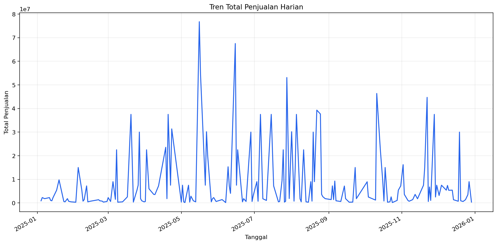
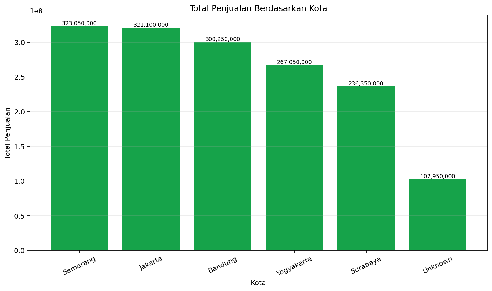

# Apache Airflow ETL Pipeline Penjualan Retail

Proyek ini merupakan implementasi pipeline ETL sederhana menggunakan Apache Airflow untuk memproses dataset penjualan retail berbentuk CSV.

Pipeline melakukan ekstraksi data, validasi kualitas data, pembersihan dan transformasi, pembuatan dua agregasi, pembuatan visualisasi, serta pemuatan hasil ke folder output. Setiap DAG run juga mempunyai folder log tersendiri agar riwayat setiap trigger mudah diperiksa.

## Daftar Isi

- [Identitas Proyek](#identitas-proyek)
- [Tujuan](#tujuan)
- [Fitur Utama](#fitur-utama)
- [Arsitektur Pipeline](#arsitektur-pipeline)
- [Struktur Folder](#struktur-folder)
- [Dataset](#dataset)
- [Penjelasan Setiap Task](#penjelasan-setiap-task)
- [Aturan Validasi dan Transformasi](#aturan-validasi-dan-transformasi)
- [Hasil Agregasi](#hasil-agregasi)
- [Visualisasi](#visualisasi)
- [Log Per Trigger](#log-per-trigger)
- [Persyaratan](#persyaratan)
- [Konfigurasi Docker](#konfigurasi-docker)
- [Cara Menjalankan](#cara-menjalankan)
- [Cara Memeriksa Hasil](#cara-memeriksa-hasil)
- [Menjalankan Ulang DAG](#menjalankan-ulang-dag)
- [Troubleshooting](#troubleshooting)
- [Catatan Keamanan](#catatan-keamanan)

## Identitas Proyek

- **Nama proyek:** Apache Airflow ETL Pipeline Penjualan Retail
- **DAG ID:** `etl_sederhana_25573877PPA07227`
- **NIM:** `25/573877/PPA/07227`
- **Jenis dataset:** Penjualan retail sintetis
- **Format data:** CSV
- **Orkestrator:** Apache Airflow
- **Executor lokal:** SequentialExecutor
- **Database metadata lokal:** SQLite

## Tujuan

Tujuan proyek ini adalah membuat pipeline ETL yang mampu:

1. Membaca data penjualan dari folder raw.
2. Memindahkan salinan data ke area staging.
3. Memeriksa struktur dan kualitas data.
4. Menangani nilai kosong dan data numerik yang tidak valid.
5. Menghapus record duplikat.
6. Menghitung ulang nilai transaksi yang kosong atau tidak konsisten.
7. Membuat agregasi penjualan berdasarkan tanggal.
8. Membuat agregasi penjualan berdasarkan kota.
9. Membuat visualisasi dari hasil agregasi.
10. Menyimpan output akhir dalam format CSV dan PNG.
11. Menyimpan log setiap proses pada folder terpisah untuk setiap DAG run.

## Fitur Utama

- Pipeline terdiri dari empat task utama.
- Pemeriksaan header dan kolom wajib.
- Pemeriksaan nilai `null`, string kosong, dan spasi kosong.
- Pemeriksaan record duplikat identik.
- Pemeriksaan `sale_id` ganda.
- Validasi format tanggal `YYYY-MM-DD`.
- Konversi integer dan float secara aman.
- Pencegahan error `int("")`.
- Penghapusan record yang tidak memenuhi persyaratan minimum.
- Pengisian kota kosong menjadi `Unknown`.
- Pengisian nama produk kosong menjadi `Unknown Product` selama transformasi.
- Perhitungan ulang `total_amount` jika kosong atau tidak konsisten.
- Dua hasil agregasi dalam format CSV.
- Dua visualisasi dalam format PNG.
- Folder log terpisah untuk setiap trigger DAG.
- File log terpisah untuk setiap task.
- Aman dijalankan ulang karena file staging dan output ditimpa.
- `max_active_runs=1` untuk mencegah dua DAG run menulis file yang sama secara bersamaan.

## Arsitektur Pipeline

Urutan dependency DAG:

```text
extract_data
    -> validate_data
    -> transform_data
    -> load_data
```

Ringkasan alur data:

```text
data/raw/sales.csv
        |
        v
     EXTRACT
        |
        v
data/staging/sales_staging.csv
        |
        v
    VALIDATE
        |
        v
    TRANSFORM
        |
        +-------------------------------+
        |                               |
        v                               v
sales_daily_transformed.csv    sales_by_city_transformed.csv
        |                               |
        +---------------+---------------+
                        |
                        v
                      LOAD
                        |
        +---------------+----------------+
        |               |                |
        v               v                v
sales_daily.csv  sales_by_city.csv  visualizations/*.png
```

## Struktur Folder

```text
project-airflow/
|-- dags/
|   `-- etl_sederhana_25573877PPA07227.py
|
|-- data/
|   |-- raw/
|   |   `-- sales.csv
|   |
|   |-- staging/
|   |   |-- sales_staging.csv
|   |   |-- sales_daily_transformed.csv
|   |   `-- sales_by_city_transformed.csv
|   |
|   |-- output/
|   |   |-- sales_daily.csv
|   |   |-- sales_by_city.csv
|   |   `-- visualizations/
|   |       |-- sales_daily_trend.png
|   |       `-- sales_by_city.png
|   |
|   `-- logs/
|       `-- <logical_date>__<run_id>/
|           |-- extract.log
|           |-- validate.log
|           |-- transform.log
|           `-- load.log
|
|-- generate_dataset.py
|-- Dockerfile
|-- docker-compose.yml
|-- .gitignore
`-- README.md
```

Folder `staging`, `output`, `visualizations`, dan `logs` dibuat otomatis ketika pipeline dijalankan.

## Dataset

Dataset sumber berada di:

```text
data/raw/sales.csv
```

Kolom dataset:

| Kolom          | Tipe yang diharapkan | Keterangan                                   |
| -------------- | -------------------: | -------------------------------------------- |
| `sale_id`      |              Integer | Identitas unik transaksi                     |
| `sale_date`    |                 Date | Tanggal transaksi dengan format `YYYY-MM-DD` |
| `product_id`   |               String | Identitas produk                             |
| `product_name` |               String | Nama produk                                  |
| `quantity`     |              Integer | Jumlah unit yang terjual                     |
| `unit_price`   |        Float/Integer | Harga per unit                               |
| `total_amount` |        Float/Integer | Total nilai transaksi                        |
| `city`         |               String | Kota lokasi transaksi                        |

Dataset dibuat secara sintetis menggunakan `random.seed(42)` agar hasilnya dapat direproduksi. Nilai kosong dan baris duplikat sengaja ditambahkan agar dataset menyerupai data mentah yang belum sempurna dan membutuhkan proses ETL.

## Penjelasan Setiap Task

### 1. Extract

Task Airflow:

```text
extract_data
```

Tanggung jawab task:

1. Membuat file log `extract.log` untuk DAG run yang sedang berjalan.
2. Memastikan `data/raw/sales.csv` tersedia.
3. Membuat folder staging jika belum tersedia.
4. Menyalin data raw menjadi `data/staging/sales_staging.csv`.
5. Menghitung jumlah record tanpa menghitung header.
6. Menulis lokasi file dan jumlah record ke log.

Task Extract tidak mengubah isi data sumber.

### 2. Validate

Task Airflow:

```text
validate_data
```

Tanggung jawab task:

1. Membuat file log `validate.log`.
2. Memastikan file staging tersedia.
3. Memastikan CSV memiliki header.
4. Memastikan seluruh kolom wajib tersedia.
5. Memastikan CSV memiliki record data.
6. Menghitung nilai kosong pada setiap kolom.
7. Menghitung record duplikat identik.
8. Menghitung `sale_id` ganda.
9. Memeriksa nilai numerik yang tidak valid.
10. Memeriksa tanggal yang tidak sesuai format.
11. Menulis ringkasan validasi ke log.

Task Validate melaporkan masalah kualitas data. Nilai kosong dan duplikat tidak langsung menghentikan pipeline karena pembersihan dilakukan oleh task Transform.

### 3. Transform

Task Airflow:

```text
transform_data
```

Tanggung jawab task:

1. Membuat file log `transform.log`.
2. Membaca data dari staging.
3. Menghapus record duplikat identik.
4. Menghapus record dengan `sale_id` yang sudah diproses.
5. Membersihkan dan mengonversi nilai setiap kolom.
6. Melewati record yang field kritisnya tidak valid.
7. Mengisi kota kosong menjadi `Unknown`.
8. Mengisi nama produk kosong menjadi `Unknown Product`.
9. Menghitung ulang `total_amount` jika diperlukan.
10. Membuat agregasi harian.
11. Membuat agregasi berdasarkan kota.
12. Menulis dua file hasil transformasi ke staging.
13. Membuat dua visualisasi PNG.
14. Menulis statistik transformasi ke log.

### 4. Load

Task Airflow:

```text
load_data
```

Tanggung jawab task:

1. Membuat file log `load.log`.
2. Memastikan seluruh file hasil transformasi tersedia.
3. Membuat folder output jika belum tersedia.
4. Menyalin agregasi harian ke `data/output/sales_daily.csv`.
5. Menyalin agregasi kota ke `data/output/sales_by_city.csv`.
6. Menghitung jumlah baris setiap output.
7. Memastikan kedua visualisasi tersedia.
8. Menulis lokasi seluruh output ke log.

## Aturan Validasi dan Transformasi

### Nilai kosong

Nilai berikut dianggap kosong:

- `None`
- String kosong `""`
- String yang hanya berisi spasi

Kolom kritis yang kosong menyebabkan record dilewati:

- `sale_id`
- `sale_date`
- `product_id`
- `quantity`
- `unit_price`

Kolom yang dapat diberi nilai pengganti:

- `product_name` menjadi `Unknown Product`
- `city` menjadi `Unknown`

### Konversi angka

Fungsi `safe_int()` digunakan agar nilai seperti berikut tidak menyebabkan task gagal:

```text
"5"   -> 5
"5.0" -> 5
""    -> None
None  -> None
"abc" -> None
```

Fungsi `safe_float()` digunakan untuk mengonversi harga dan total transaksi dengan aman.

### Validasi tanggal

Tanggal harus mengikuti format:

```text
YYYY-MM-DD
```

Contoh tanggal valid:

```text
2025-01-31
```

Record dengan tanggal kosong atau tidak valid akan dilewati.

### Deduplikasi

Pipeline melakukan dua lapisan deduplikasi:

1. **Duplikat identik**, yaitu dua record dengan seluruh nilai kolom yang sama.
2. **Sale ID ganda**, yaitu record yang mempunyai `sale_id` sama dengan record yang sudah diproses.

### Perhitungan ulang total transaksi

Nilai yang diharapkan dihitung dengan rumus:

```text
expected_total = quantity * unit_price
```

`total_amount` dihitung ulang jika:

- Nilainya kosong.
- Nilainya bukan angka.
- Nilainya negatif.
- Selisih dengan `expected_total` lebih dari `0.01`.

## Hasil Agregasi

### Agregasi Harian

File output:

```text
data/output/sales_daily.csv
```

Kolom:

| Kolom                | Keterangan                                    |
| -------------------- | --------------------------------------------- |
| `sale_date`          | Tanggal transaksi                             |
| `total_transactions` | Jumlah transaksi valid pada tanggal tersebut  |
| `total_quantity`     | Total unit yang terjual pada tanggal tersebut |
| `total_sales`        | Total nilai penjualan pada tanggal tersebut   |

Data diurutkan berdasarkan tanggal secara menaik.

### Agregasi Berdasarkan Kota

File output:

```text
data/output/sales_by_city.csv
```

Kolom:

| Kolom                | Keterangan                                 |
| -------------------- | ------------------------------------------ |
| `city`               | Nama kota atau `Unknown`                   |
| `total_transactions` | Jumlah transaksi valid pada kota tersebut  |
| `total_quantity`     | Total unit yang terjual pada kota tersebut |
| `total_sales`        | Total nilai penjualan pada kota tersebut   |

Data diurutkan berdasarkan `total_sales` dari nilai terbesar.

## Visualisasi

Pipeline membuat dua visualisasi menggunakan Matplotlib.

### Tren Penjualan Harian

File:

```text
data/output/visualizations/sales_daily_trend.png
```

Jenis grafik: line chart.

- Sumbu X menampilkan tanggal transaksi.
- Sumbu Y menampilkan total penjualan harian.
- Grafik digunakan untuk melihat perubahan penjualan dari waktu ke waktu.

Contoh penyisipan gambar pada GitHub setelah pipeline dijalankan:

```markdown

```


### Penjualan Berdasarkan Kota

File:

```text
data/output/visualizations/sales_by_city.png
```

Jenis grafik: bar chart.

- Sumbu X menampilkan kota.
- Sumbu Y menampilkan total penjualan.
- Nilai penjualan ditampilkan di atas setiap batang.
- Kota diurutkan berdasarkan total penjualan terbesar.

Contoh penyisipan gambar pada GitHub setelah pipeline dijalankan:

```markdown

```


Matplotlib menggunakan backend `Agg` agar visualisasi dapat dibuat di dalam container tanpa tampilan desktop.

## Log Per Trigger

Selain log bawaan pada Airflow UI, pipeline menyimpan log tambahan di:

```text
data/logs/
```

Setiap trigger DAG membuat satu folder sendiri. Nama folder menggabungkan `logical_date` dan `run_id` Airflow yang telah dibuat aman untuk filesystem.

Contoh:

```text
data/logs/
|-- 20260917T153243__manual__2026-09-17T15_32_43_00_00/
|   |-- extract.log
|   |-- validate.log
|   |-- transform.log
|   `-- load.log
|
`-- 20260918T010000__scheduled__2026-09-18T01_00_00_00_00/
    |-- extract.log
    |-- validate.log
    |-- transform.log
    `-- load.log
```

Keterangan file:

- `extract.log` mencatat ekstraksi data.
- `validate.log` mencatat hasil pemeriksaan kualitas data.
- `transform.log` mencatat pembersihan, record yang dilewati, agregasi, dan visualisasi.
- `load.log` mencatat hasil pemuatan file output.

Semua task dalam satu DAG run menggunakan folder yang sama karena menggunakan `logical_date` dan `run_id` yang sama. Trigger berikutnya menghasilkan `run_id` baru sehingga folder log baru dibuat secara otomatis.

## Persyaratan

Perangkat lunak yang dibutuhkan:

- Docker
- Docker Compose
- Browser untuk mengakses Airflow UI

Dependency Python tambahan:

- `matplotlib==3.9.2`

Modul berikut berasal dari standard library Python:

- `csv`
- `datetime`
- `logging`
- `pathlib`
- `shutil`

## Konfigurasi Docker

### Dockerfile

Gunakan Dockerfile berikut agar Matplotlib tersedia di dalam image Airflow:

```dockerfile
FROM apache/airflow:2.10.5-python3.12

USER airflow

RUN pip install --no-cache-dir matplotlib==3.9.2
```

### Docker Compose

Contoh `docker-compose.yml`:

```yaml
services:
  airflow:
    build: .
    image: tugas-airflow-etl:local

    environment:
      AIRFLOW__CORE__EXECUTOR: SequentialExecutor
      AIRFLOW__CORE__LOAD_EXAMPLES: 'False'
      AIRFLOW__CORE__DAGS_FOLDER: /opt/airflow/dags
      AIRFLOW__CORE__DAGS_ARE_PAUSED_AT_CREATION: 'True'

    ports:
      - '8080:8080'

    volumes:
      - ./dags:/opt/airflow/dags
      - ./data:/opt/airflow/data

    command:
      - bash
      - -c
      - |
        set -e

        airflow db migrate

        airflow users create \
          --username admin \
          --password admin123 \
          --firstname Admin \
          --lastname User \
          --role Admin \
          --email admin@mail.com \
        || echo "User admin sudah ada, pembuatan user dilewati"

        airflow scheduler &
        exec airflow webserver
```

Pemetaan volume berikut diperlukan agar DAG tersedia di container:

```yaml
- ./dags:/opt/airflow/dags
```

Pemetaan volume berikut diperlukan agar data, output, visualisasi, dan log tetap tersedia pada host:

```yaml
- ./data:/opt/airflow/data
```

## Cara Menjalankan

### 1. Clone repository

```bash
git clone <URL_REPOSITORY_ANDA>
cd <NAMA_FOLDER_REPOSITORY>
```

Ganti placeholder dengan URL dan nama repository GitHub yang digunakan.

### 2. Membuat dataset

Jika `sales.csv` belum tersedia, jalankan:

```bash
python generate_dataset.py
```

Pastikan file berikut terbentuk:

```text
data/raw/sales.csv
```

### 3. Build image dan menjalankan container

```bash
docker compose down
docker compose up --build
```

Opsi `--build` diperlukan setelah Dockerfile atau dependency Python berubah.

### 4. Memeriksa import DAG

Buka terminal baru, lalu jalankan:

```bash
docker compose exec airflow \
  airflow dags list-import-errors
```

Jika tidak ada import error, DAG siap dijalankan.

### 5. Membuka Airflow UI

Buka:

```text
http://localhost:8080
```

Kredensial lokal contoh:

```text
Username: admin
Password: admin123
```

### 6. Menjalankan DAG

1. Cari DAG `etl_sederhana_25573877PPA07227`.
2. Aktifkan DAG jika statusnya masih paused.
3. Pilih tombol Trigger DAG.
4. Tunggu sampai seluruh task berstatus success.
5. Periksa folder output, visualisasi, dan log.

## Cara Memeriksa Hasil

### Memeriksa file output

```bash
ls -la data/output
```

### Menampilkan agregasi harian

```bash
head data/output/sales_daily.csv
```

### Menampilkan agregasi kota

```bash
cat data/output/sales_by_city.csv
```

### Memeriksa visualisasi

```bash
ls -la data/output/visualizations
```

### Memeriksa seluruh file log

```bash
find data/logs -maxdepth 2 -type f
```

### Menampilkan daftar log transformasi

```bash
find data/logs \
  -type f \
  -name "transform.log" \
  -print
```

### Menampilkan log dari trigger terbaru

Pada Linux atau macOS:

```bash
LATEST_LOG_DIR=$(find data/logs -mindepth 1 -maxdepth 1 -type d | sort | tail -n 1)
cat "$LATEST_LOG_DIR/transform.log"
```

## Menjalankan Ulang DAG

Setelah mengubah file DAG:

```bash
docker compose restart airflow
```

Jika Dockerfile atau dependency berubah, lakukan build ulang:

```bash
docker compose down
docker compose up --build
```

Kemudian periksa import error:

```bash
docker compose exec airflow \
  airflow dags list-import-errors
```

Pada Airflow UI, lakukan Clear pada task instance lama jika diperlukan, kemudian trigger DAG kembali.

## Troubleshooting

### DAG tidak muncul di Airflow UI

Periksa import error:

```bash
docker compose exec airflow \
  airflow dags list-import-errors
```

Pastikan file DAG berada di:

```text
./dags/etl_sederhana_25573877PPA07227.py
```

Pastikan volume DAG sudah dipetakan ke container.

### Error `No module named matplotlib`

Penyebabnya adalah Matplotlib belum tersedia di image Airflow.

Pastikan Dockerfile berisi:

```dockerfile
RUN pip install --no-cache-dir matplotlib==3.9.2
```

Kemudian build ulang:

```bash
docker compose down
docker compose up --build
```

### Error `invalid literal for int()`

Error terjadi ketika string kosong langsung diberikan kepada `int()`.

DAG final menggunakan fungsi `safe_int()` dan `safe_float()` agar nilai kosong atau rusak dapat ditangani tanpa langsung menggagalkan task.

### File sumber tidak ditemukan

Pastikan file tersedia pada host:

```text
data/raw/sales.csv
```

Di dalam container, file harus tersedia sebagai:

```text
/opt/airflow/data/raw/sales.csv
```

### Folder log tidak muncul

Pastikan task sudah benar-benar dijalankan. Folder dibuat ketika task memanggil `configure_process_log()`.

Pastikan folder `/opt/airflow/data` dapat ditulis oleh user Airflow dan volume berikut tersedia:

```yaml
- ./data:/opt/airflow/data
```

### Task pada satu trigger membuat folder berbeda

Pastikan penamaan folder menggunakan nilai berikut dari context Airflow:

```python
context["logical_date"]
context["run_id"]
```

Jangan menggunakan `datetime.now()` sebagai sumber utama nama folder karena setiap task dapat mulai pada waktu berbeda.

### Visualisasi tidak terbentuk

Periksa `transform.log` pada folder DAG run terkait. Pastikan:

- Task Transform berstatus sukses.
- Matplotlib sudah terpasang.
- Folder output dapat ditulis.
- Hasil agregasi tidak kosong.

### Task gagal karena permission denied

Pastikan folder data dapat ditulis oleh container. Pada lingkungan lokal berbasis Linux, periksa permission folder:

```bash
ls -ld data data/output data/logs
```

Sesuaikan permission berdasarkan lingkungan lokal yang digunakan.

## Contoh `.gitignore`

Gunakan `.gitignore` berikut jika log dan file staging tidak ingin disimpan ke GitHub:

```gitignore
# Python
__pycache__/
*.py[cod]

# Airflow runtime
airflow.db
*.pid

# Staging files
data/staging/*
!data/staging/.gitkeep

# Per-run logs
data/logs/*
!data/logs/.gitkeep

# Environment
.env
.venv/
venv/

# Editor and OS
.vscode/
.idea/
.DS_Store
Thumbs.db
```

Jika output CSV dan visualisasi ingin ditampilkan pada GitHub, jangan masukkan `data/output/` ke `.gitignore`.

## Catatan Keamanan

Kredensial berikut hanya contoh untuk lingkungan lokal:

```text
Username: admin
Password: admin123
```

Untuk penggunaan di luar tugas atau lingkungan lokal:

- Jangan menyimpan password langsung di `docker-compose.yml`.
- Gunakan environment variable atau secret management.
- Jangan mengunggah file `.env` yang berisi kredensial.
- Jangan mengunggah data asli yang bersifat sensitif.

## Lisensi

Proyek ini dibuat untuk keperluan pembelajaran. Tambahkan file `LICENSE` jika repository akan dibagikan atau digunakan ulang dengan ketentuan lisensi tertentu.

## Penulis

**Hikmah Nursidik**  
NIM: `25/573877/PPA/07227`
